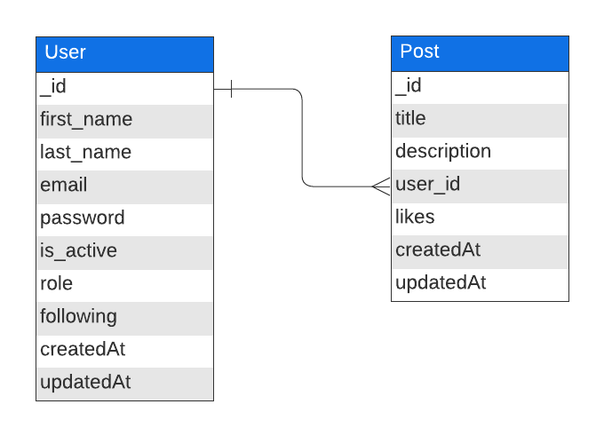

# Social Media MongoDB Project

This project was made as part of a course Full Stack Developer for GeeksHubs Academy.

## Index 🔍

- [Assignment](#assignment-)
- [Stack](#stack)
- [Database Diagram](#database-diagram)
- [Local Installation](#local-installation-️)
- [Endpoints](#endpoints)
- [Points of Improvement](#points-of-improvement)

## Assignment 📝

GeeksHub gave the assignment to develop the backend for a social media platform.  
A social media platform on which users can register, access the network, post and interact.

You can find the related frontend project here: [GH_P7_SocialMedia_Frontend](https://github.com/MandySpaan/GH_P7_SocialMedia_Frontend)

## Stack 💻

 

## Database Diagram 📊

This diagram shows the structure of the database tables.

## Local installation 🛠️

### Backend

1. Clone the repository
   `$ git clone https://github.com/MandySpaan/GH_P5_SocialMedia_Backend`
2. Install dependencies
   `$ npm install --y`
3. Copy the file .env.example, change the name to .env and fill in all the fields
4. Plant the seeds into the tables
   `$ npm run db:seed`
5. Start the server
   `$ npm run dev`

### Frontend

You can find the frontend project here: [GH_P7_SocialMedia_Frontend](https://github.com/MandySpaan/GH_P7_SocialMedia_Frontend)

1. Clone the repository
   `$ git clone https://github.com/MandySpaan/GH_P7_SocialMedia_Frontend`
2. Install dependencies
   `$ npm install --y`
3. Start the server
   `$ npm run dev`

## Endpoints ⚙️

Authentication

| Method |        URI         |            Action             |             Auth              |                                               Body                                                |
| :----: | :----------------: | :---------------------------: | :---------------------------: | :-----------------------------------------------------------------------------------------------: |
|  POST  | /api/auth/register |      Register a new user      | 
N/A (public)
 | `{ "username": "yourUsername", "email": "youremail@email.com",` `"password": "yourPassword" }` |
|  POST  |  /api/auth/login   | Login a user and return a JWT | 
N/A (public)
 |   `{ "identifier": "youremail@email.com" or "yourUsername",` `"password": "yourPassword" }`    |

Users

| Method |              URI              |             Action             |             Auth              |                                                                              Body                                                                               |
| :----: | :---------------------------: | :----------------------------: | :---------------------------: | :-------------------------------------------------------------------------------------------------------------------------------------------------------------: |
|  GET   |          /api/users           |         View all users         |     Token (isSuperAdmin)      |                                                                      
N/A
                                                                       |
|  GET   |      /api/users/profile       |   View your own user profile   |         Token (user)          |                                                                      
N/A
                                                                       |
|  GET   | /api/users/following/profiles |    View following profiles     |         Token (user)          |                                                                      
N/A
                                                                       |
|  GET   |    /api/users/profile/:id     |  View user profile by user id  | 
N/A (public)
 |                                                                      
N/A
                                                                       |
|  PUT   |      /api/users/profile       |      Update user profile       |         Token (user)          | `{ "first_name": "newFirstName",` `"last_name": "newLastName",` ` "username": "newUsername",` ` "email": "newEmail",` `"password": "newPassword" }` |
|  PUT   |     /api/users/follow/:id     | Follow user profile by user id |         Token (user)          |                                                                      
N/A
                                                                       |

Posts

| Method |         URI          |             Action              |          Permissions          |                                  Body                                   |
| :----: | :------------------: | :-----------------------------: | :---------------------------: | :---------------------------------------------------------------------: |
|  POST  |      /api/posts      |           Create post           |         Token (user)          |    `{ "title": "postTitle",` `"description": "postDescription" }`    |
| DELETE | /api/posts/admin/:id |     Delete post by post id      |     Token (isSuperAdmin)      |                          
N/A
                           |
| DELETE |    /api/posts/:id    | Delete your own post by post id |         Token (user)          |                          
N/A
                           |
|  PUT   | /api/posts/like/:id  |      Like post by post id       |         Token (user)          |                          
N/A
                           |
|  PUT   |    /api/posts/:id    | Update your own post by post id |         Token (user)          | `{ "title": "newPostTitle",` `"description": "newPostDescription" }` |
|  GET   |    /api/posts/own    |       View your own posts       |         Token (user)          |                          
N/A
                           |
|  GET   |     /api/posts/      |         View all posts          | 
N/A (public)
 |                          
N/A
                           |
|  GET   | /api/posts/user/:id  |      View post by user id       | 
N/A (public)
 |                          
N/A
                           |
|  GET   | /api/posts/following |      View following posts       |         Token (user)          |                          
N/A
                           |
|  GET   |    /api/posts/:id    |      View post by post id       | 
N/A (public)
 |                          
N/A
                           |

## Points of Improvement 💡

Some extra possible functionalities to be added:

- The option to retrieve all of a persons followers
- The option to add images to user profiles and posts
- The option to search for a user by username or name
